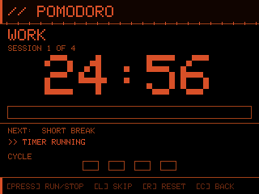

# WioDeck - Cyberpunk Toolkit for Wio Terminal

<p align="center">
  <br>
  
</p>

A personal toolkit for the [Seeed Wio Terminal](https://wiki.seeedstudio.com/Wio-Terminal-Getting-Started/). Screens plug into a joystick-navigated menu — each one is a self-contained `.cpp` file. Add a screen, register it in the menu, done. Companion host-side tools live in `tools/`.

## Screens

| Screen | File | Description | Preview |
|---|---|---|---------|
| **Pomodoro** | `pomodoro.cpp` | Classic Pomodoro focus timer — 4× (25 min work → 5 min break) → 15 min long break. Start/pause, skip phase, reset. Buzzer alerts on phase change. |  |
| **Stopwatch** | `stopwatch.cpp` | Stopwatch with lap splits |  |
| **Countdown** | `countdownTimer.cpp` | Countdown timer with HH:MM:SS input. Hold UP/DOWN to adjust, LEFT/RIGHT to cycle fields. Buzzer beeps on expiry. |  |
| **Sys Stats** | `sysStats.cpp` | Arc gauges for CPU, RAM, GPU, VRAM usage + temperatures and network bandwidth, fed over USB serial or BLE |  |
| **Process Watch** | `processWatch.cpp` | Top-5 CPU processes by usage, fed over USB serial or BLE |  |
| **Claude Usage** | `claudeUsage.cpp` | Displays session (5h) and weekly (7d) Claude API utilisation, fed over USB serial or BLE |  |
| **Sonar** | `ultrasonicSensor.cpp` | [Seeed Grove Ultrasonic Distance Sensor](https://wiki.seeedstudio.com/Grove-Ultrasonic_Ranger/) (SKU 101020010) — semicircular arc gauge with proximity zones (cyan/amber/magenta). Uses the single-pin SIG protocol (not separate TRIG/ECHO). **Right Grove port** (SIG→A0). | |
| **AP Scan** | `wifiAnalyser.cpp` | Wi-Fi analyser — list view (SSID, band, channel, dBm, signal bar) + 2.4 GHz and 5 GHz channel congestion maps. Yellow triangle marks the least-congested non-overlapping channel (1, 6, or 11). | |
| **BLE Scanner** | `bleScanner.cpp` | Scans for nearby BLE devices and displays RSSI signal strength | |
| **Matrix Rain** | `matrixRain.cpp` | Animated Matrix-style digital rain |  |
| **Robot Eyes** | `robotEyes.cpp` | Sound-reactive animated robot face — 4 states (IDLE/CURIOUS/ALERT/SHOCK) driven by mic amplitude. | |
| **Temp + Humidity** | `tempHumidity.cpp` |[Seeed Grove DHT11](https://wiki.seeedstudio.com/Grove-TemperatureAndHumidity_Sensor/) temperature & humidity sensor — colour-coded readings, 2 s refresh. Displays °C or °F based on the Temp Unit setting. **Right Grove port** (data→A0). | |
| **SD Card Viewer** | `sdCardViewer.cpp` | Browse and display BMP images on the microSD card. Three-level navigation: **folder picker → file list → image viewer**. KEY_A steps back one level; KEY_C returns to menu. Supports 16, 24, and 32-bit BMP. | |
| **Settings** | `settings.cpp` | Settings menu with six sub-screens across two pages — **Page 0:** Backlight (brightness), Volume (buzzer level), Temp Unit (°C/°F); **Page 1:** Sensors (live accelerometer/light/mic dashboard), Battery (SoC, voltage, current, health), Device Info (MCU specs, memory, serial number, firmware build). All settings persist to flash. |  |

## Hardware

- Seeed Wio Terminal
- (Optional) Seeed Battery Chassis 650mAh — enables the battery % overlay in the top-right corner of every screen

## Build & upload

Requires [PlatformIO](https://platformio.org/).

```bash
pio run                   # build only
pio run --target upload   # build and upload over USB
```

## Adding a screen

1. Create `src/myScreen.cpp` with a function `void myScreen()` that blocks until the user exits (KEY_C).
2. Declare it in `include/globals.h`.
3. Add an entry to `menuItems[]` in `src/main.cpp` and a `case` in `navigation()` in `src/menu.cpp`.

Every screen has access to:

| Utility | Where |
|---|---|
| TFT display (`tft`) | `globals.h` → `TFT_eSPI` |
| Battery overlay | `drawBatteryStatus(bgColor)` in `battery.cpp` |
| BLE data channel | `bleSetActive()`, `checkBLE()` in `bluetooth.cpp` |
| Serial data channel | `checkSerial()` in `claudeUsage.cpp` |
| Backlight control | `backLight.setBrightness()` via `globals.h` |

## Navigation (hardware)


| Input | Action |
|---|---|
| KEY_A (top-right) | Jump directly to Settings screen |
| KEY_C (top-left) | Return to menu from any screen |
| Joystick UP / DOWN | Move menu selection |
| Joystick PRESS | Enter selected screen |
| Joystick LEFT / RIGHT | Adjust value (brightness / volume sub-screens) |

## Project layout

```
wiodeck/
├── src/
│   ├── main.cpp               Global definitions, setup(), loop(), screen dispatch
│   ├── menu.cpp               Main menu render + joystick navigation
│   ├── settings.cpp           Settings menu + sub-screens (backlight/volume/sensors/device-info)
│   ├── sensors.cpp            Sensor dashboard (accelerometer, light, mic)
│   ├── deviceInfo.cpp         Device info (MCU, memory, serial number, firmware build)
│   ├── battery.cpp            BQ27441-G1A I²C driver + battery overlay
│   ├── bluetooth.cpp          BLE GATT peripheral + shared BLE infrastructure
│   ├── claudeUsage.cpp        Claude Usage screen
│   ├── sysStats.cpp           Sys Stats screen (arc gauges)
│   ├── pomodoro.cpp           Pomodoro timer
│   ├── stopwatch.cpp          Stopwatch with lap splits
│   ├── countdownTimer.cpp     Countdown timer
│   ├── processWatch.cpp       Top-5 CPU processes
│   ├── ultrasonicSensor.cpp   Sonar screen (Grove ultrasonic sensor, arc gauge, proximity zones)
│   ├── wifiAnalyser.cpp       Wi-Fi analyser (list + 2.4 GHz / 5 GHz channel maps)
│   ├── bleScanner.cpp         BLE device scanner
│   ├── sdCardViewer.cpp       SD card BMP viewer
│   ├── screenshot.cpp         KEY_B: saves screen to microSD as SCREENSHOTS/SCRN####.BMP
│   ├── robotEyes.cpp          Sound-reactive robot eyes (4 states, mic-driven)
│   ├── tempHumidity.cpp       Grove DHT11 temperature & humidity screen
│   └── matrixRain.cpp         Matrix-style digital rain
├── include/
│   ├── globals.h              extern declarations + function prototypes
│   ├── lcd_backlight.hpp      SAMD51 TC0 PWM backlight driver
│   └── RawImage.h             Seeed template for raw bitmap format
└── tools/
    ├── claude_sender.py       Feed Claude usage data — USB serial or --ble
    ├── process_sender.py      Feed top CPU processes — USB serial or --ble
    ├── sysstat_sender.py      Feed PC system stats — USB serial or --ble
    └── bitmap-converter/      PySide6 GUI — convert images to Wio Terminal bitmap format
```

## Host tools

Both sender scripts support USB serial and BLE via a `--ble` flag.

**`claude_sender.py`** — streams Claude API usage to the Claude Usage screen:

```bash
pip install httpx pyserial        # serial mode
pip install httpx bleak           # BLE mode

python tools/claude_sender.py COM3          # Windows serial
python tools/claude_sender.py /dev/ttyACM0  # Linux/macOS serial
python tools/claude_sender.py --ble         # BLE auto-discover
python tools/claude_sender.py --ble AA:BB:CC:DD:EE:FF  # BLE to address
```

Reads your Claude OAuth token from `~/.claude/.credentials.json`, or from the macOS Keychain (`Claude Code-credentials`) if that file is absent.

**`process_sender.py`** — streams top CPU-consuming processes to the Process Watch screen.
Memory shown is `phys_footprint` (resident + compressed, matching Activity Monitor) on macOS with `sudo`; falls back to RSS otherwise:

```bash
pip install psutil pyserial        # serial mode
pip install psutil bleak           # BLE mode

python tools/process_sender.py COM3          # Windows serial
python tools/process_sender.py /dev/ttyACM0  # Linux/macOS serial
python tools/process_sender.py --ble         # BLE auto-discover
sudo python tools/process_sender.py --ble    # macOS: accurate memory (phys_footprint)
python tools/process_sender.py --ble AA:BB:CC:DD:EE:FF  # BLE to address
```

**`sysstat_sender.py`** — streams PC system stats (CPU, RAM, GPU, network) to the Sys Stats screen:

```bash
pip install psutil pyserial              # serial mode
pip install psutil bleak                 # BLE mode
pip install nvidia-ml-py                 # optional: NVIDIA GPU stats
pip install wmi                          # optional: Windows CPU temperature (needs LibreHardwareMonitor)

python tools/sysstat_sender.py COM3                      # Windows serial
python tools/sysstat_sender.py /dev/ttyACM0              # Linux/macOS serial
python tools/sysstat_sender.py --ble                     # BLE auto-discover
python tools/sysstat_sender.py --ble AA:BB:CC:DD:EE:FF   # BLE to address
```

## BLE

The BLE peripheral is shared — any screen can use it. It advertises as `WT-001` and runs only while a screen holds `bleSetActive(true)`.

- Service UUID: `4e495554-494f-5500-0000-000000000001`
- RX characteristic: `4e495554-494f-5500-0000-000000000002`

## SD card viewer

Place BMP files in the root of the microSD card. The viewer accepts standard 24-bit and 32-bit BMP files (Windows BI_RGB and BI_BITFIELDS). Screenshots saved by KEY_B are automatically compatible.
